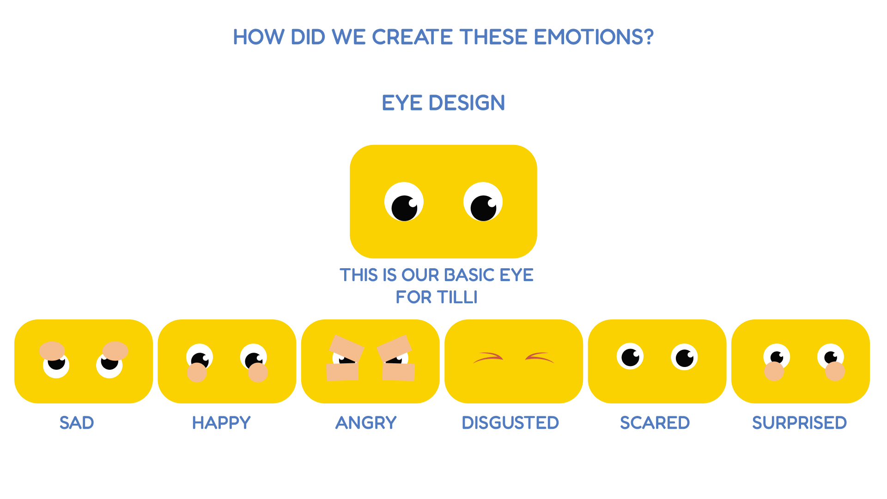
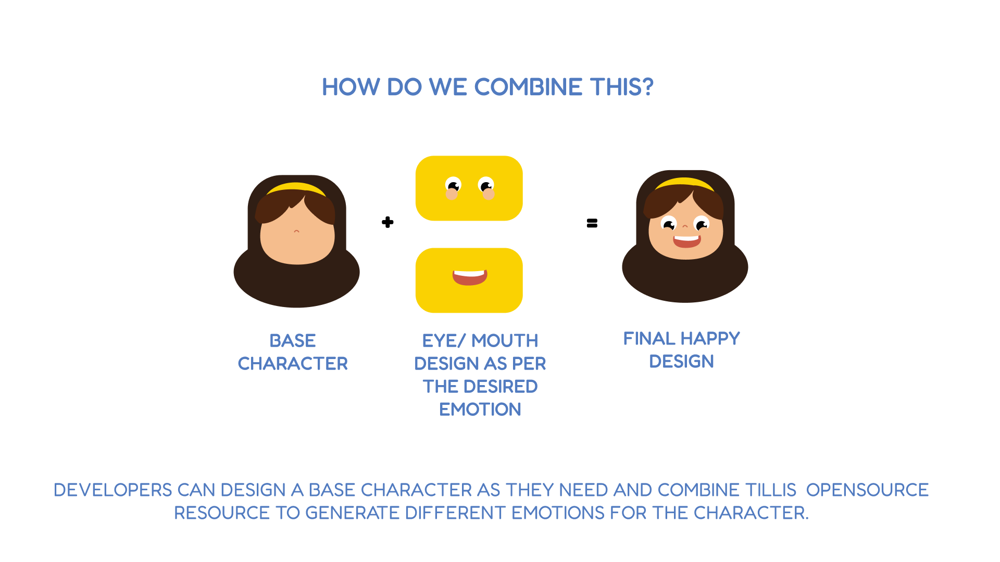
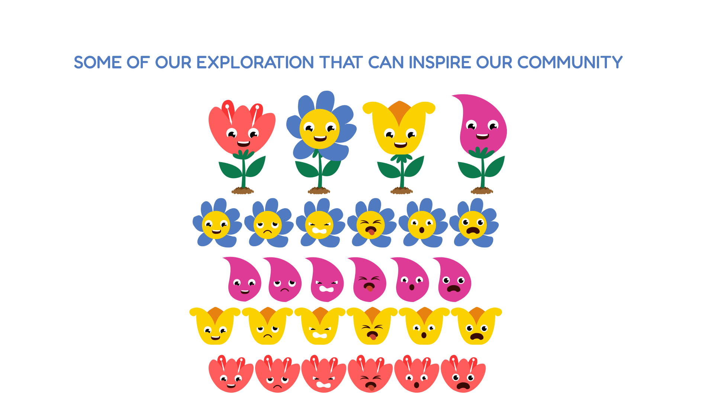
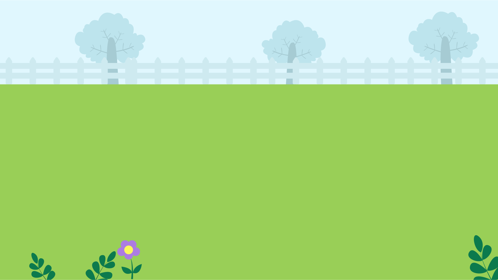
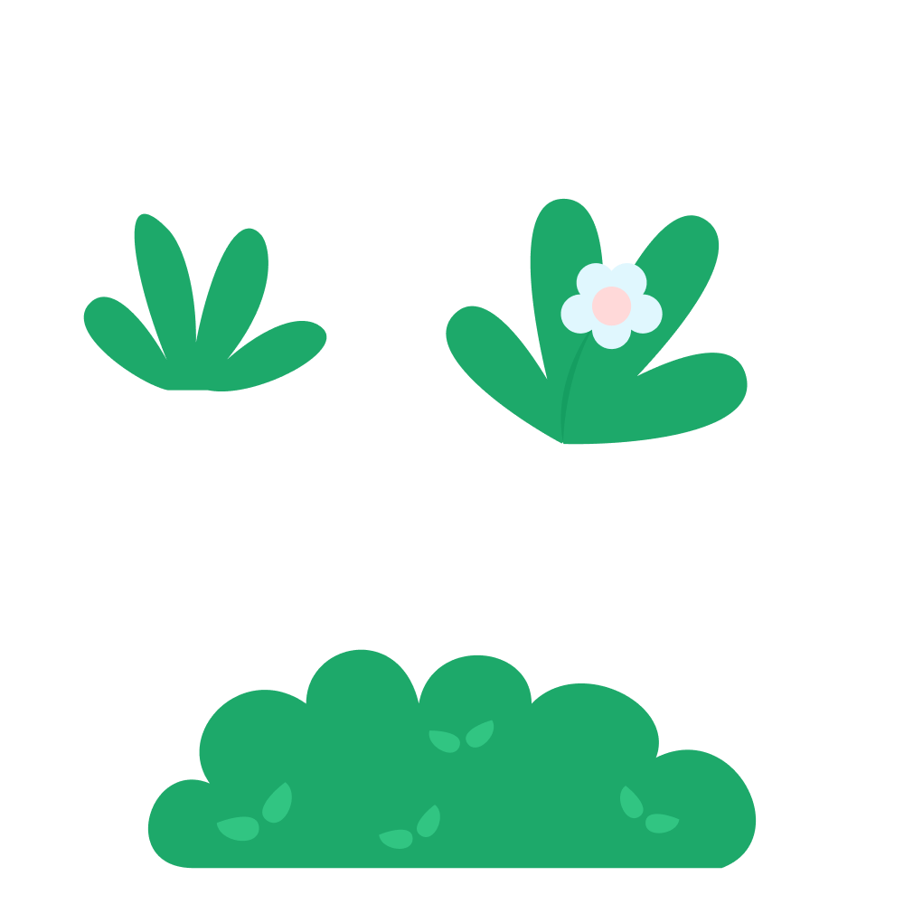

# Art assets

## Character Design

Character design has been designed to make it scalable and modular.
Always avoid sharp edges in the character design.

### Tilli

Tilli character can be found in this link:

Tilli Reference image:

Tilli in different Views:

Tilli Facial Expressions are modular. Eyes and Lips are designed to obtain a desired emotion.

### Assets

The assets used can be found in the link below:

#### Background

#### Tree

#### Bush

### UI Elements

UI Elements are designed as per Tillis brand. The edges/corners of the icon/UI elements are rounded. 

UI Elements can be found here:

Some of the UI Icons:

