# Module Creators
For those organisations or individuals with development background who are interested to create more content or modules in the web-app can do so via the IDE. 

## IDE: 

### Introduction 
(What it is, How it works, What it has)

The IDE is a prototyping platform that allows one to create, customize and upload one’s own content and curriculum for children to interact with via a web-app.

### Features available inside the IDE

There are 3 main sections that one needs to work with inorder to create a complete module:

- Image Manager
- Theme
- Module

A module comprises of a set of screens called theme that uses assets like images, animations (only gifs) etc.

#### Image Manager 

The image manager is a section in the IDE where you can upload and store the following types of assets: images, videos, gifs and audio.

These are the assets that you will use when creating a screen aka theme.

Available Features:

You can upload and store the following files and file types:

- Image: 
    - .jpg, 
    - .png
- Video: 
    - .mp4
- Gif: .
    - gif
- Audio: 
    - .mp3

Please ensure that you use only the above file types for your assets else they cannot be uploaded and stored.

Remember to also upload images of your screens into the Image Manager for reference purposes.

#### Theme

Theme is a section in the IDE where you can create all your screens one at a time with the relevant content, user interface, assets from the Image Manager and assign specific actions. 

Available Features:

There are three types of themes:

- Static

This option allows you to create a screen using just an image and cannot have any other function besides moving on to the next screen on tapping

Unique Tracking tags cannot be added to a static screen

- Dynamic

This option allows you to create layers that can be triggered on tapping any sort of assets added on the theme like a specific image or UI etc.

For example: Using a Dynamic theme, you can create a screen that has Multiple choice question where clicking on one answer will reveal whether the answer is correct or wrong via another layer and then on clicking next button, it will take you to the next screen.

Unique Tracking Tags can be added to a dynamic screen

- Godot

This option allows you to upload a zipfile of a game created in Godot. You can integrate the game in the IDE via Module

#### Module

Module is a section in the IDE where you can compile all the screens you have created in the theme section in the order of your choice to make one complete game/curriculum.

### How to create your own module

How to create your own module

Before getting started with the IDE, you will first need to keep the following ready:

Create your UX screens and assets for the Module you want to build as shown below

We use penpot, an open source design tool that allows us to create and export UX screens and assets.

Here are some tutorial links for Penpot:
* [Penpot Fundamentals](https://www.youtube.com/watch?v=MpINco5nWw4&list=PLgcCPfOv5v57cJS0im5FYFwbsu6X5mkNq) 
* [Tutorials by the Community](https://www.youtube.com/watch?v=-MNcIatBS3Y&list=PLgcCPfOv5v555ckHlaZAHJnsvpFEnlQLJ)
* [How to Design an App in Penpot](https://www.youtube.com/watch?v=KUg3xIFWK_g&list=PLgcCPfOv5v54WpXhHmNO7T-YC7AE-SRsr)

 Export your UX screens and assets in separate folders
 

 

 Once you have all the screens, assets and gifs ready, you can add your content in the IDE and create your own modules. Let’s get started:
* #### Log In to the IDE
Once your organization sets up the IDE in your system, log into the same via email id and password assigned.

After you login you will land on the dashboard page.
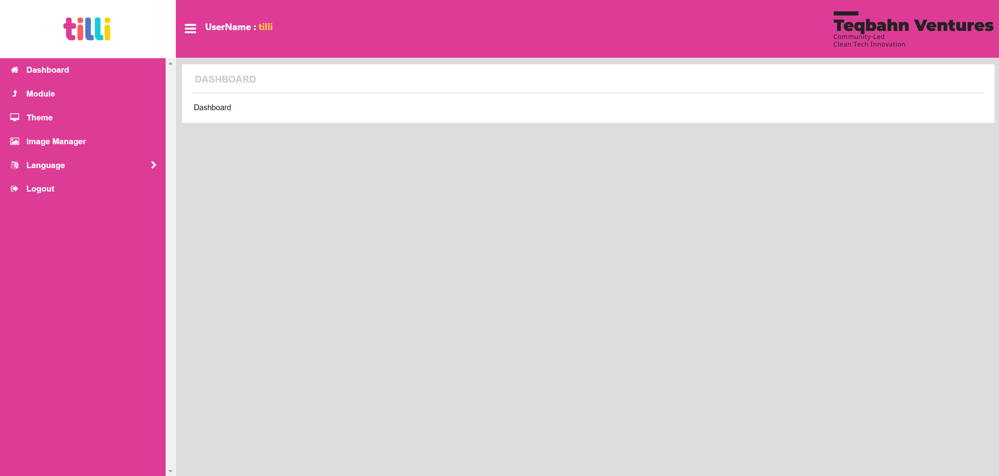

* #### Uploading Assets to the IDE
Click on “Image Manager” on the Left 

You will land on the Image Manager Screen as shown below
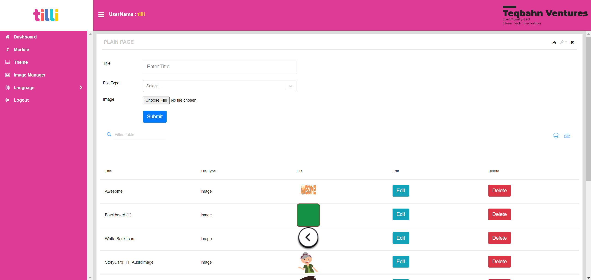

Select the “File Type” of the asset you want to upload into the IDE. In this example: I have selected Image.
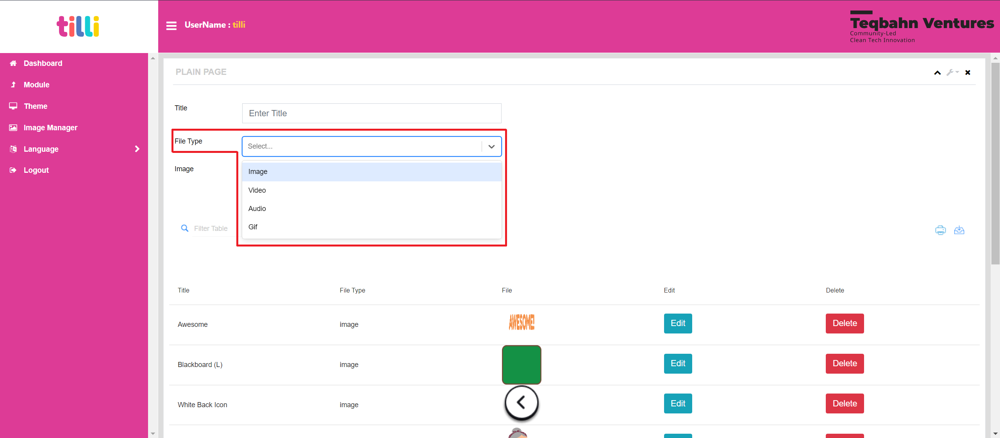

Choose the asset/screen image that you want to upload from the "Folder” you created in your system
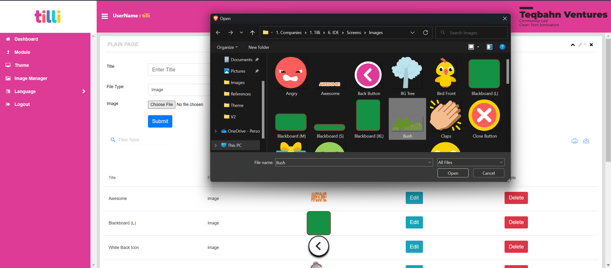

Once you have selected the asset/screen image, name your asset/screen image in the “Title” section. 

Tip: Having proper naming conventions for your assets and screens will help you sort and match assets for your screens
.png "Dashboard")

Click on “Submit” and wait until the save progress bar (Green pop up that says “Added Data”) closes automatically
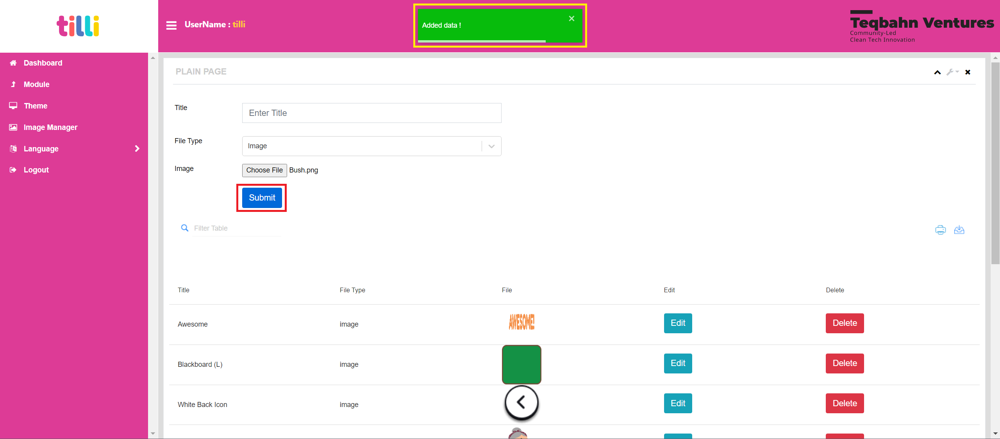

If you want to search for an asset/screen image that is uploaded on the IDE, you can type the asset name into the “Search Bar”

If you want to rename an asset/screen image that is uploaded on the IDE, you can click on the “Edit” Button on the right next to the asset/screen image

You can then rename the asset/screen image in the “Title” section and click on “Edit” to save the new name
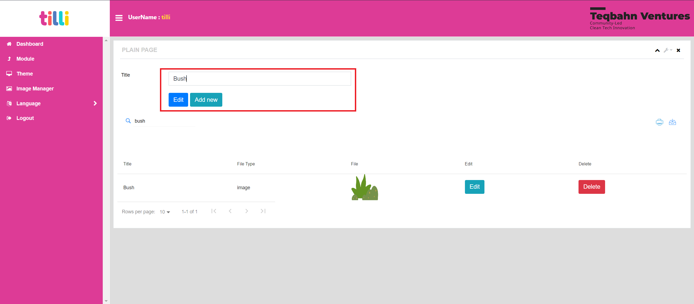

Please Note: The “Add New” Button is to add a new asset instead of renaming an existing asset/screen image.

After you have added all the assets and screens required for your module you can move on to building Themes for your Module.

* #### Uploading Themes in the IDE

Click on “Theme” on the Left and you will land on the screen shown below.

You will land on the Theme Screen as shown below. Click on “Add Theme” Button
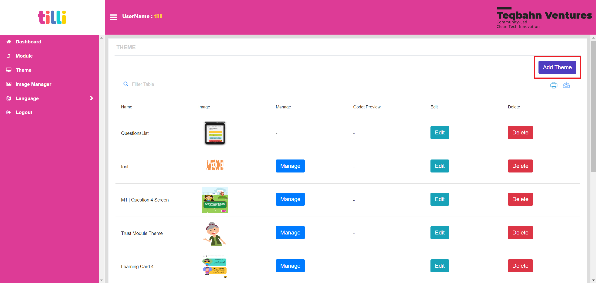

You will get a pop up called “Manage Theme” that has the following categories

- Theme Name
- Transparent Image
- Theme Type
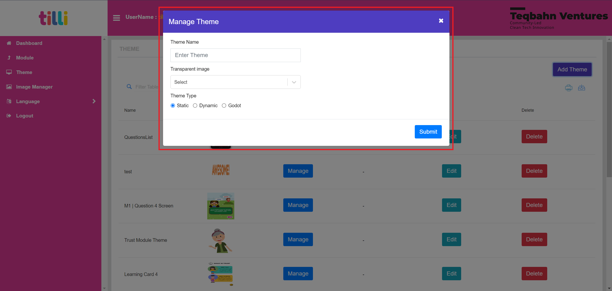

Let's begin by creating a Start Screen for a Demo Module. 
Enter the “Theme Name” as “ Demo | Start Screen”
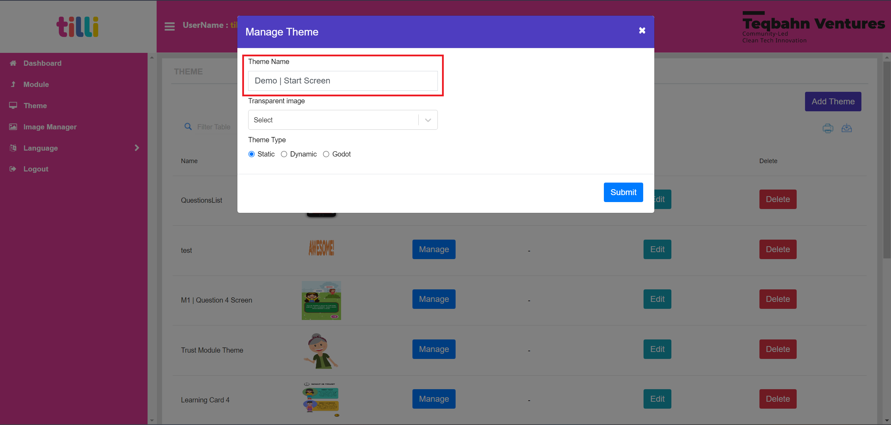

Under “Transparent Image” select the Image of the screen, you will notice that the selected screen appears on the right.
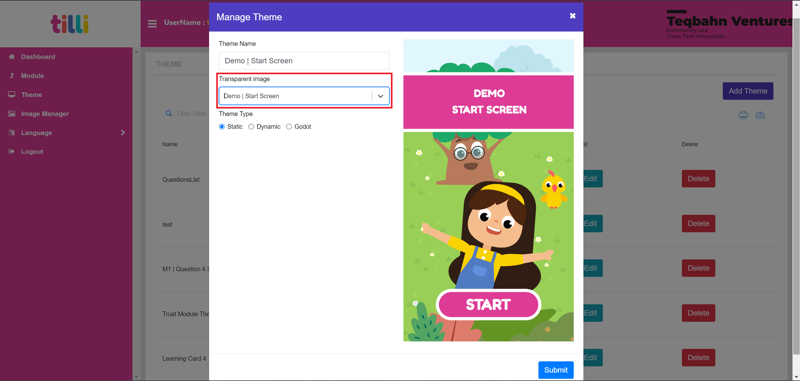

Under “Theme Type” select the “Dynamic” option
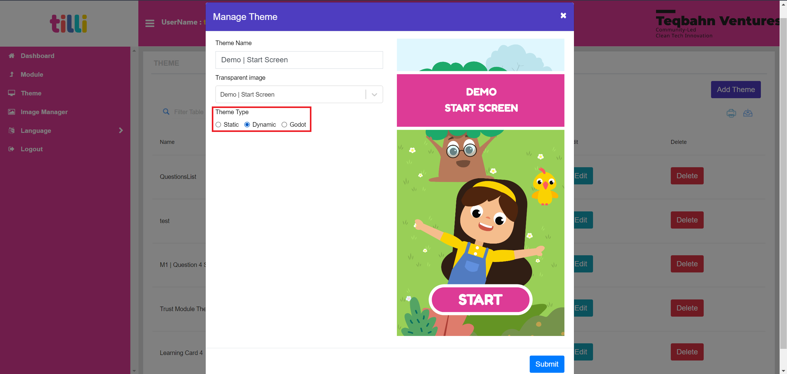

Click on “Submit” to save this theme
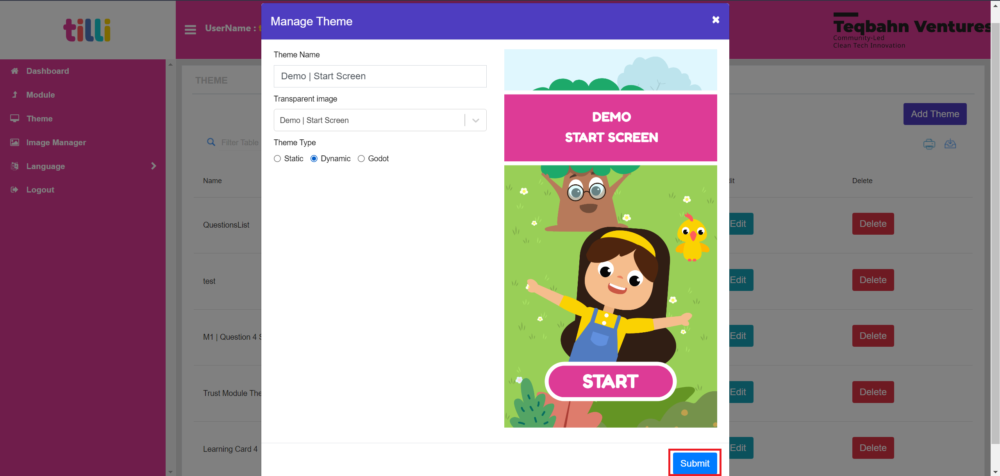

Wait until the save progress bar (Green pop up that says “Added Data”) closes automatically and then add any other remaining screens needed for your module
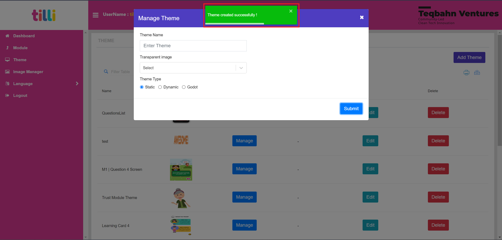

* #### Creating a Theme in the IDE (Screen with Single Button)

Let’s start by creating a Start Screen. It has one button functionality that takes you to the next screen. 

Search for the Screen that you want to create as shown below

Click on “Manage”- This allows you to create/edit screens that you would later add inside a module

You will land on the “Theme Creation Page”. 
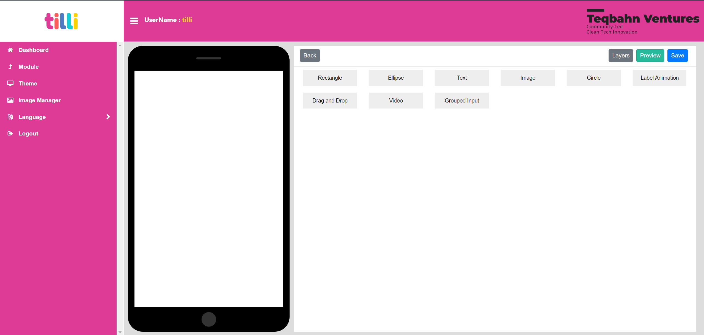

This page has the following components:

- Rectangle (Active)
- Ellipse (Active)
- Text (Active)
- Image (Active)
- Circle (Active)
- Label Animation (WIP, Not Active)
- Drag and Drop (WIP, Not Active)
- Video (WIP, Not Active)
- Grouped Input (WIP, Not Active)

You can drag and drop the component that you wish to use into the phone screen (1920x1080px) and it creates a layer. Please Note: Currently, the components added in the IDE works in descending layers and we cannot reorder our layers. 

This means that you need to add the background first followed by components at the front.

The elements under “Layer”, allows you to customize the component (in this case rectangle, same applies for other components)

Functionality of each element is as stated below:

- X: Moves the component in X axis (Left & Right)
- Y: Moves the component in Y axis (Top and Bottom)
- Width: Changes the the measurement of the component from side to side
- Height: Changes the the measurement of the component from base to top
- Background: Changes the colour of the component
- Border Width: Adds a thickness to the component
- Border Radius: Curves the edges of the component

Font Family and Font Style doesnt apply to components such as Rectangle, Ellipse, Circle and Image

If this any layer needs to appear only after clicking on another component, then you can hide the layer by deselecting the “Visibility” option. By default visibility is enabled

If you wish to delete the component, then you can click on the “Delete” option, on the button right corner in the Layer Section

“Actions” allow you to add certain functions to your component (you can only add one function per component)

These are the following actions in the dropdown:
- Previous (Active)
- Next (Active)
- Record (Active, For Speech to Text Feature only)
- Record Press (Active, For Speech to Text Feature only)
- Reset Text (Active, For Speech to Text Feature only)
- Change Layout (Active)
- Correct Answer (WIP, Not Active)
- Wrong Answer (WIP, Not Active)
- Checked Layout (WIP, Not Active)

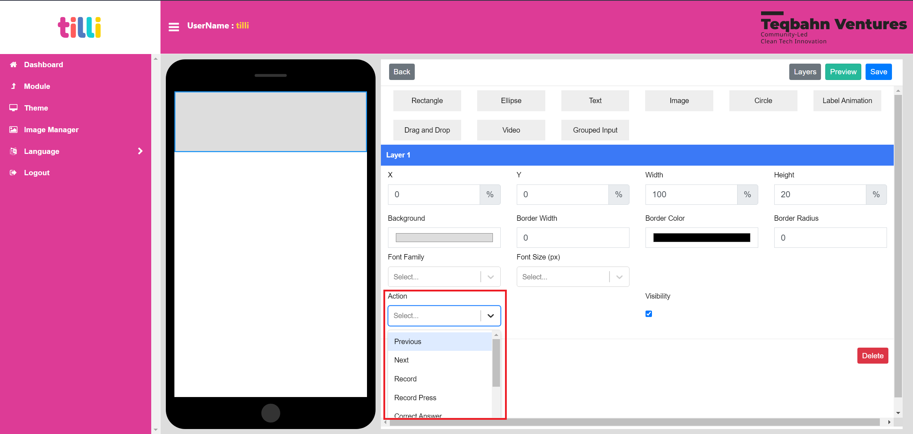

Functionality of each active action is as as stated below:

- Previous: Clicking on a component that has this action will take the user to the previous theme/screen
- Next: Clicking on a component that has this action will take the user to the next theme/screen
- Record: Clicking on a component that has this action will record audio said by user
- Record Press: Clicking on a component that has this action will enable the record audio functionality
- Reset Text: Clicking on a component that has this action will erase the text output that was recorded by user via audio
- Change Layout: Clicking on a component that has this action will enable and disables certain components to display on the screen as a layer instead of going to previous or next screen

In the case of Text Component it has the following elements to work with:

Functionality of each element is as stated below:

- X: Moves the text box in X axis (Left & Right)
- Y: Moves the text box in Y axis (Top and Bottom)
- Width: Changes the the measurement of the text box from side to side
- Height: Changes the the measurement of the text box from base to top
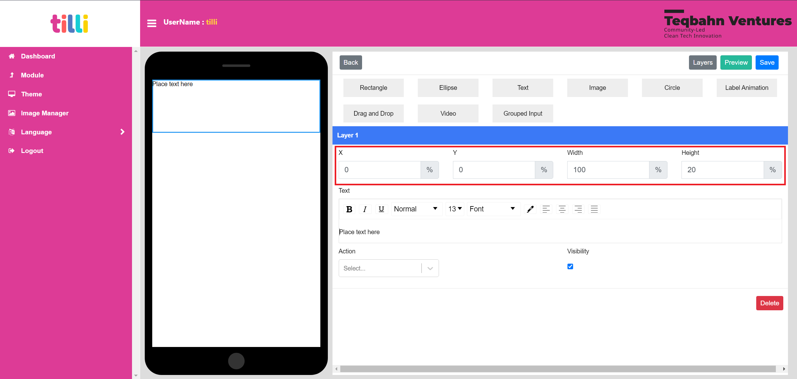

- B: Makes the selected text Bold
- I: Makes the selected text Italic
- U: Underlines the selected text
- Text Styles: Provides options of heading styles
- Font Size: Provides options to select size of text
- Font: Provides options to select type of font
- Colour Picker: Provides options of colours to choose from for the text
- Alignment options: Provides option to left align, right align, center align and justify selected text
- Text Box: To write the text
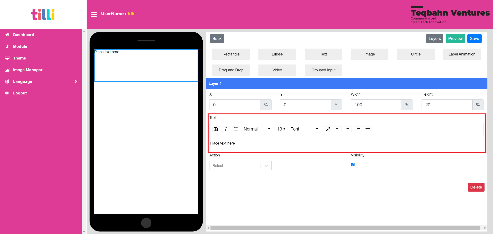

In the case of Image Component it has the following elements to work with:

Functionality of each element is as stated below:

- X: Moves the image in X axis (Left & Right)
- Y: Moves the image in Y axis (Top and Bottom)
- Width: Changes the the measurement of the image from side to side
- Height: Changes the the measurement of the image from base to top

“Select Image” Button, allows you to upload an image/asset (gifs can be used too)
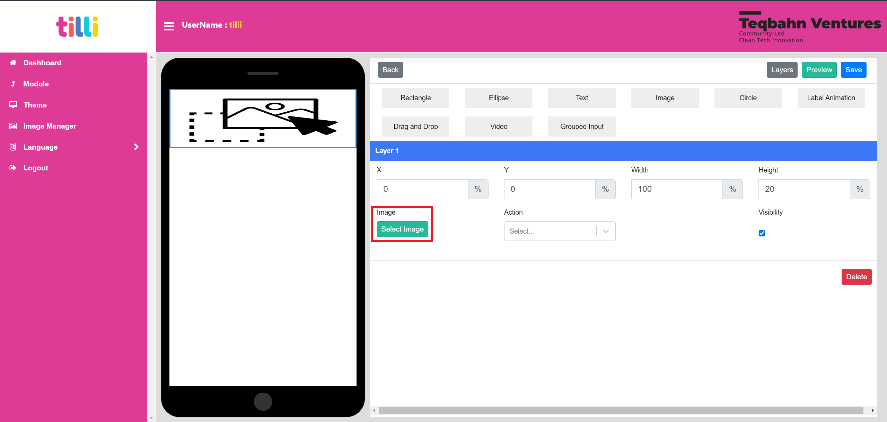

Search for the image/gif you want to add and click on “Save Changes” button and the image is added to the theme
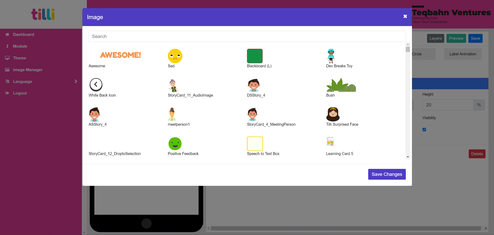

The “Layers” Button on the top right corner allows you to see the components used in the theme and you can enable/disable them
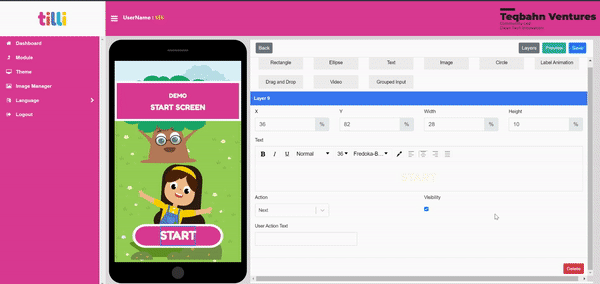

Here is a demo video on how to create a theme:
https://drive.google.com/file/d/1a0bbpByMgS80ugkSyYhKiDUUlogTn3X2/view?usp=share_link

Remember to click on “Save” on the top right corner and wait until the save progress bar (Green pop up that says “Successfully updated”) closes automatically

Please Note: Ensure the themes you create have components that have an action to move to the next or previous screen etc
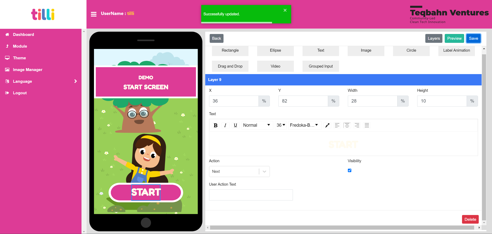

* ####  Creating a Module in the IDE
Once you create all the themes required, we can compile them to into a module that can be played in the Web-App. But first you click on “Module” on the Left 
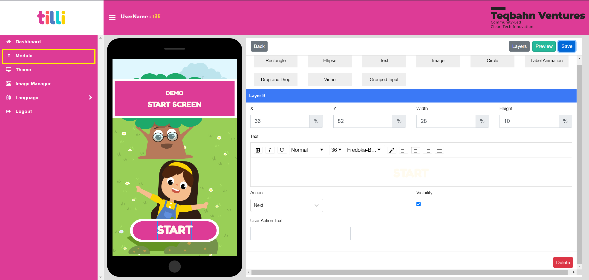

You will land on the Module Screen as shown below
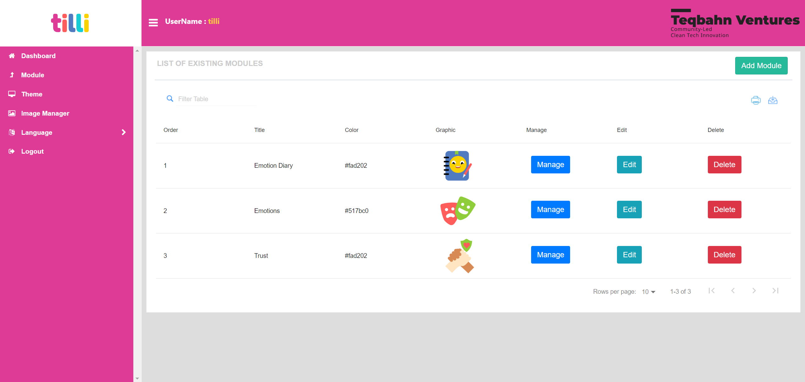

Click on “Add Module” on the top right corner
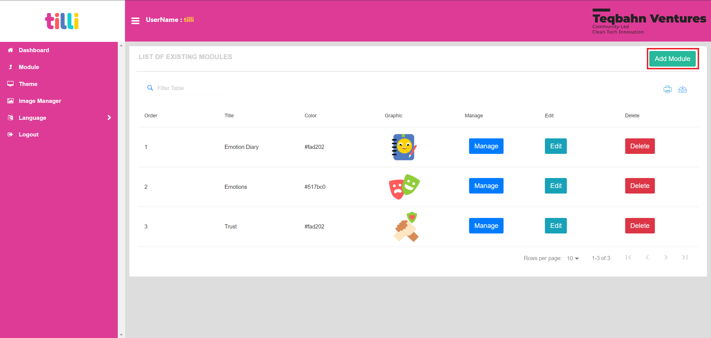

You will see the following section appear:
- Title: Enter the Name of your module
- Graphic: Select an icon for your module thats already uploaded in image manager
- Colour: Enter a Hex Code for the icon BG colour
- Sort Order: Enter a number for the module to appear in that order (1 being the first module to display)
- Submit Button: Creates a Module for you to add themes in
- Cancel Button: Discards the inputs in this section and doesnt save the module

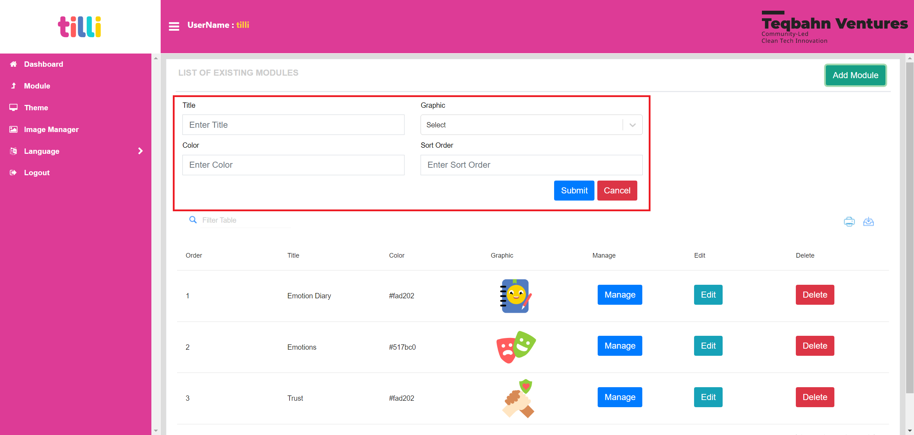

Fill in the details as per your module and requirements under each section

Once you are done click on “Submit”
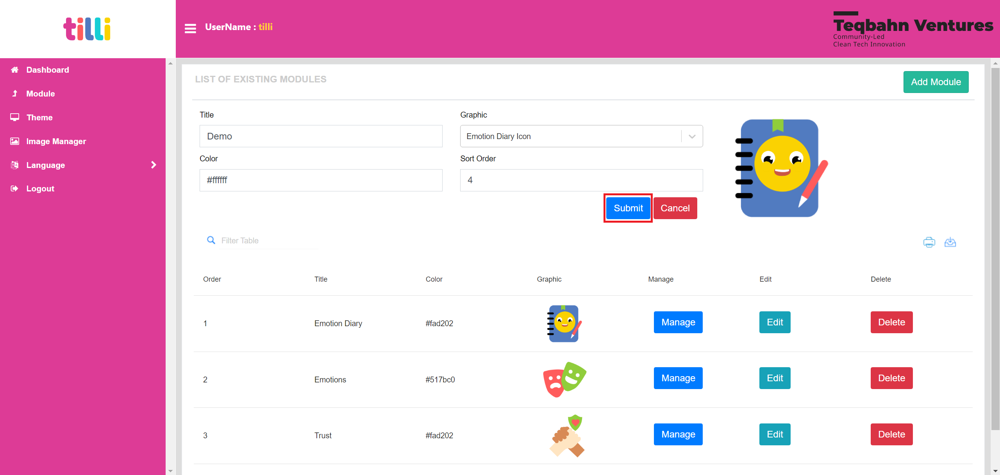

Wait until the save progress bar (Green pop up that says “Module is created Successfully”) closes automatically

Click on “Manage”- This allows you to add the themes/screens you created into the module
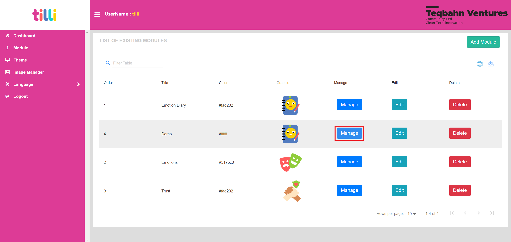

You will land on the Module Creation Screen as shown below

Click on “Add Theme” displayed on the bottom of the screen
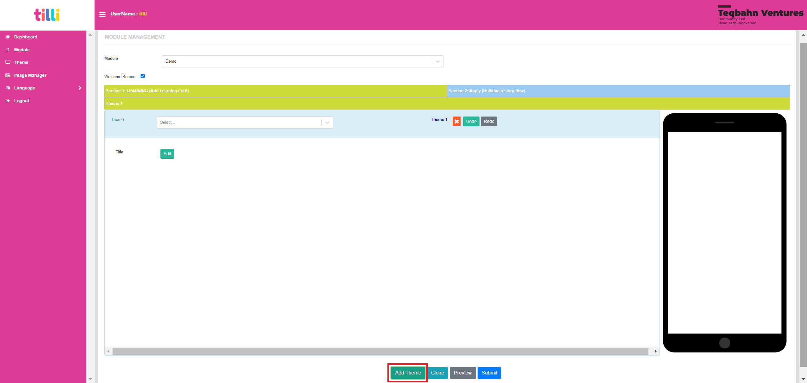

You will notice a section called “Theme” with a dropdown menu. Either type or search for the theme you want to add first in the module. The dropdown menu displays all the themes you have created in the IDE.

As an example, the theme selected is “Demo | Start Screen” and you are able to view the theme’s editable components as well.

You can also add a Background Audio to the theme. 
Please Note: The Background Audio section displays only the audios that are uploaded on the IDE.

If you wish to add more themes, click on “Add theme” and repeat until you have added all the screens.

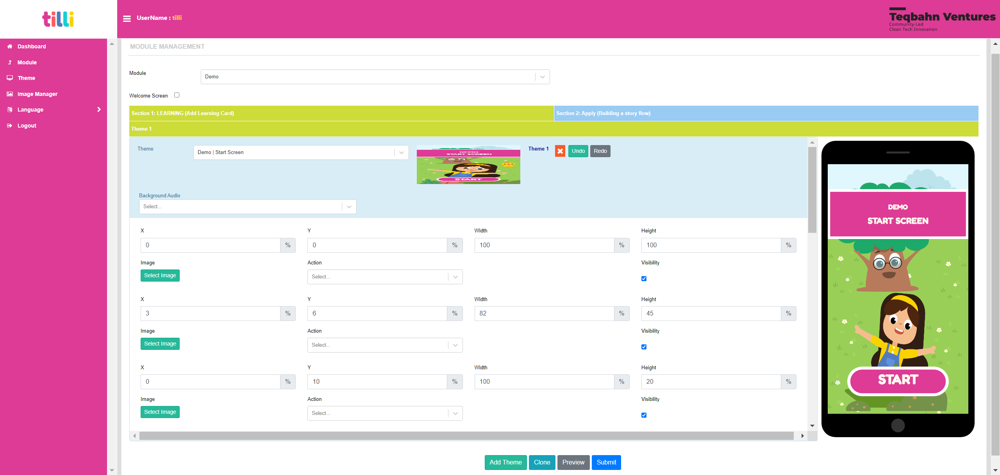

You can also upload a godot strategy as a theme and it would display as shown below.

Once you are done with adding all the themes and uploading the audios, click on “Submit” to save it into the module.

You can now refresh the web-app link set up by your organization and your module should be live and ready to play!
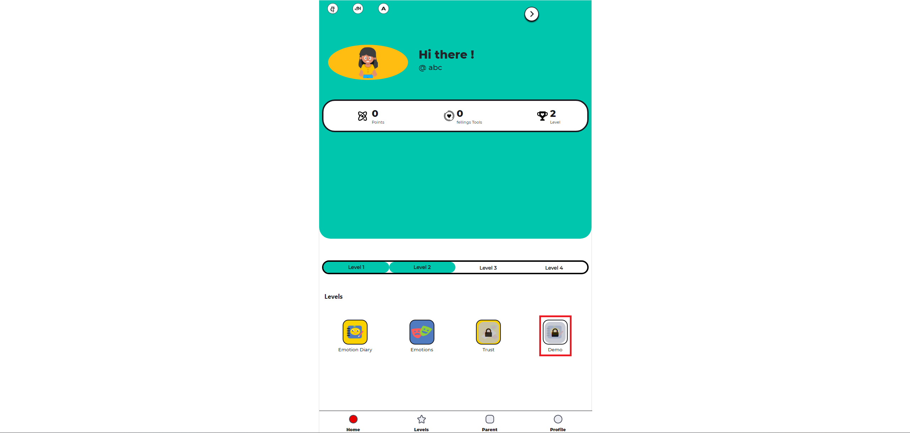

### How to view your own module

Kindly refer to the following documentation here:
[IDE + Web App: (Backend + Frontend Developers)](Repo-Ide.md)

### How to Give Feedback or Report Bugs or Request New Features

Kindly go to the “Report Bugs, Issues or Share Feedback” Section in our Contribution Guidelines for filing any issue/bugs, feedback, to clarify doubts or propose a new feature through our GitHub forms.

## Web App

### About the Game 
(What it is, How it works, What it has)

Tilli Safety Tool Box is a web-app, play-based learning experience on Social-Emotional Learning for Child Online Safety. The focus of this project is to help parents and caregivers have meaningful conversations with their children and teachers, educators and social workers deliver powerful learning to their students!

Tilli Safety Tool Box comprises of an Emotion Diary and 3 modules:
 
- Emotion Diary: (Launched)
This section allows your child to express and manage their emotions anytime and everyday
It also personalizes your child strategies to feel better according to their preferences

- Module 1: Feelings and Emotions (Launched)
Learn to identify, label and express emotions and feelings
Develop healthy coping strategies to manage big feelings
 
- Module 2: Trust (Launched)
At the core of staying safe is knowing who and what to trust
Understand what trust means, looks, and feels like 
Practice tools like the trust circle to make safer choices 
 
- Module 3: Digital Safety (WIP)
Understanding internet safety and developing positive habits around safe sharing, noticing red flags, being kind and reaching out to a trusted adult
 
Tilli’s Safety Tool Box and the modules you create can be accessed with a Web browser over the World Wide Web on any mobile device. Unlike classical game software, browser-based games can be played instantly and do not require a prior installation! 

Play Tilli’s Safety Toolbox here: https://tilli.teqbahn.com/tilli-web 

### How to Report Bugs, Issues or Share Feedback

Kindly go to the “Report Bugs, Issues or Share Feedback” Section in our Contribution Guidelines for filing any issue/bugs, feedback, to clarify doubts or propose a new feature through our GitHub forms.

## Godot Mini Games

### About the ABCDE Strategies

We have created 6 different types of strategies/ activities in Godot that help people regulate and manage their emotions better. It aids in reducing stress or anxiety during stressful/ negative scenarios, thus enabling oneself keep a positive self-image and outlook in life.

#### Ideology

If you want to know more about what are ABCDE strategies: [Read Here](https://docs.google.com/document/d/1LtxitcCUhgsUzjIeFYDdqus4t8h6SDbAjwVKQUtDt7A/edit?usp=sharing)

The 6 ABCDE Strategies are:

- Yoga
Zip File: HERE
Design Documentation: [HERE](https://docs.google.com/document/d/1ZiZ07BwrDwRqOX5hrtREvo7ncnVkOR5u1zSYS4CkfOc/edit?usp=sharing)

- Bubble Pop
Zip File: HERE
Design Documentation: [HERE](https://docs.google.com/document/d/14SLCAqWyhhJSi7_0UrhkfbxTF3vAv6cq5oegouETnz0/edit?usp=sharing)

- Rainbow Breathing
Zip File: HERE
Design Documentation: [HERE](https://docs.google.com/document/d/1yAe6VvVNCmBjj--Tr7tOfmOGZ8HgcHIfR7i30y4HhZc/edit?usp=sharing)

- Water Drinking
Zip File: HERE
Design Documentation: [HERE](https://docs.google.com/document/d/1uUCKTr9SfK4VLlgN_3mwWfcPW4m5awM9zz3msXPGr5g/edit?usp=sharing)

- Colouring
Zip File: HERE
Design Documentation: [HERE](https://docs.google.com/document/d/1M9Rti033Abqa7Xfr2dA3SwCboLT4f4BAbtOEduMOKEA/edit?usp=sharing)

- Self Hug
Zip File: HERE
Design Documentation: [HERE](https://docs.google.com/document/d/1yelkAW0z0afdggm5z2q1F6FO_AVTIzLUIeWrNK3vAWk/edit?usp=sharing)

### Assigning Logic for 6 in 1 Strategy

The logic behind assigning one of the above mentioned strategies is explained here: [Read Here](https://docs.google.com/document/d/139G3rM3TD-hQW4VbKHdDTWL5wk0VNgFKFEB7FGFwVbs/edit?usp=sharing)

6 in 1 Strategy Zip File to use in IDE: [HERE](https://drive.google.com/file/d/1c1QrPNx5sN9hK9KFU54Mrg6RnyrNeoWb/view?usp=share_link)

Please Note: As of now the logic is implemented as to test which strategy helps the kids better and will be further improved in the next iterations based on the feedback received from this version.

### How to Report Bugs, Issues or Share Feedback

Kindly go to the “Report Bugs, Issues or Share Feedback” Section in our Contribution Guidelines for filing any issue/bugs, feedback, to clarify doubts or propose a new feature through our GitHub forms.

Last updated : 27/7/2023
